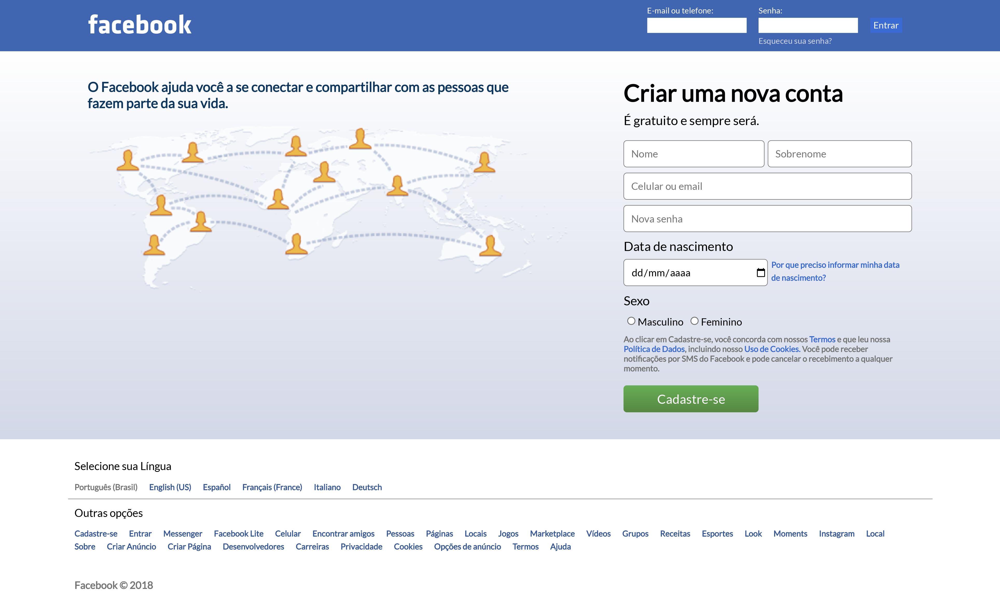

## 📲 Facebook's Old Login Screen 📲

### 📄 Resumo do Projeto 📄
Criei uma tela de login inspirada na antiga interface de entrada do Facebook (2016 ~ 2018).

### 🖼️ Prévia do Projeto 🖼️

  

### 📖 Descrição do Projeto 📖
Esse é um projeto no qual simulo o antigo design da interface de login do Facebook, que pra mim foi muito marcante para a Era Digital. É um modelo parecido com o do professor da Danki Code, Guilherme Grillo, porém feito do 0 e com  mais textos e ajustes adicionais. Como foquei apenas no design propriamente dito e apesar dos links, a página não possui funcionalidades, porém consta com uma ótima responsividade quando atinge a largura de um tablet. Além do design responsivo, com esse projeto fui capaz de treinar e estudar sobre fontes e tonalidades de cores para simular a tela do website oficial.

Esse projeto marca minha consolidação em HTML5 e meu início com CSS3, portanto em breve terão muito mais projetos responsivos e atualizados!

### 🛠️ Tecnologias aprendidas e utilizadas 🛠️

  
  

Agradeço a sua atenção e leitura deste documento!

Atenciosamente, 

Milton Salgado ⚡